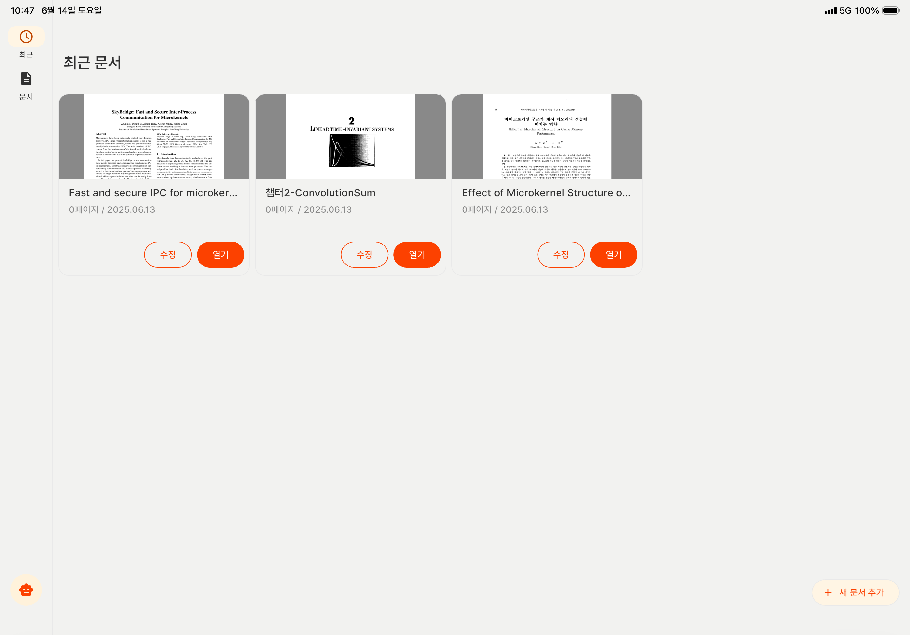
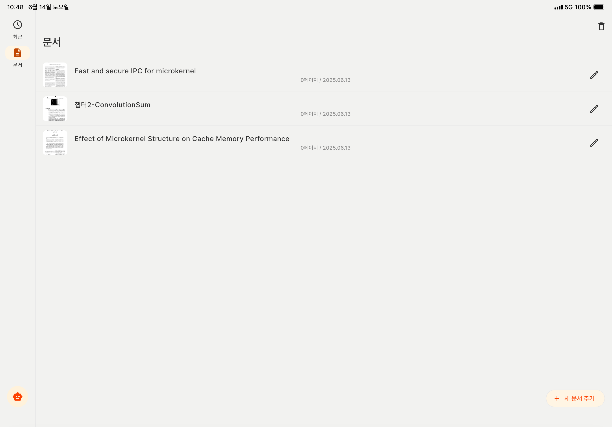
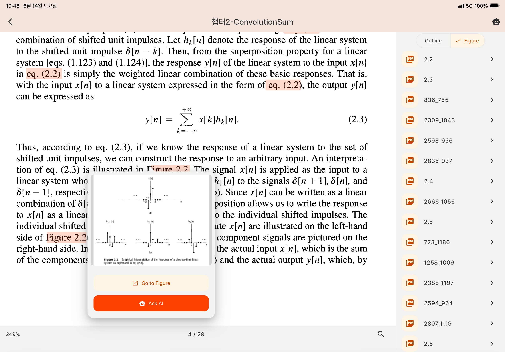
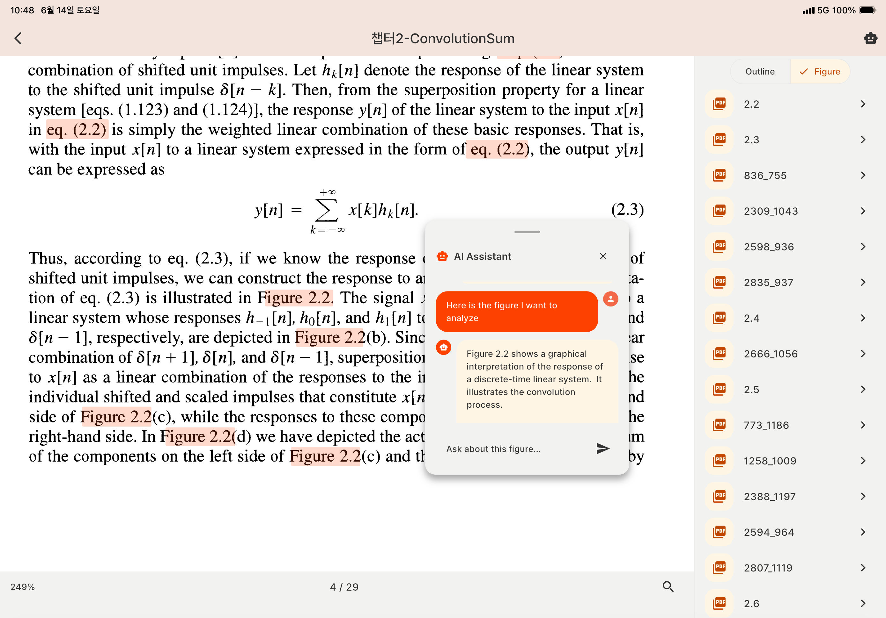
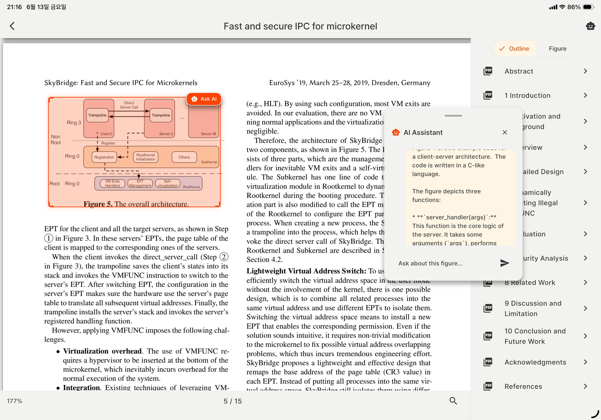

# SnapFig 📚✨

[](https://flutter.dev)
[](https://developer.apple.com/ios/)
[](https://developer.android.com)
[](https://opensource.org/licenses/Apache-2.0)

> **대학생을 위한 스마트 전공서적 학습 도우미**  
> OCR과 AI를 활용해 전공서적의 Figure와 텍스트를 연결하고, 실시간 질의응답으로 학습 효율을 극대화하는 모바일 앱

---

## 🎯 SnapFig이 해결하는 문제

**전공서적 학습의 어려움**
- 📖 복잡한 Figure와 텍스트 간의 연관성 파악이 어려움
- 🔍 중요한 그림과 설명을 찾기 위해 페이지를 계속 넘나들어야 함
- ❓ Figure에 대한 추가 설명이나 질문이 있어도 즉시 답을 얻기 어려움

**SnapFig의 해결책**
- 🤖 **AI 기반 Figure 분석**: 터치 한 번으로 Figure에 대한 상세한 설명 제공
- 🔗 **스마트 Figure 매핑**: OCR로 자동 인식된 Figure와 참조 텍스트를 연결
- 💬 **실시간 질의응답**: Figure에 대해 궁금한 점을 AI에게 바로 질문

---

## ✨ 주요 기능

### 📱 메인 화면 - 문서 관리


- **간편한 PDF 추가**: 기기에서 PDF 파일을 선택하면 자동으로 OCR 처리

### 📚 최근 문서 - 학습 이력 관리


### 🔗 Figure 매핑 - 스마트 연결


- **자동 Figure 인식**: OCR 기술로 문서 내 모든 Figure 자동 탐지
- **참조 텍스트 연결**: "Figure 1.2", "그림 3-4" 등의 참조를 자동으로 해당 Figure와 연결
- **시각적 하이라이트**: 선택한 Figure와 관련된 텍스트를 시각적으로 강조 표시

### 🤖 AI 어시스턴트 - 실시간 학습 도우미


- **다중 AI 프로바이더**: OpenAI GPT-4, Google Gemini 지원
- **드래그 가능한 채팅창**: 화면을 가리지 않도록 자유롭게 위치 조정 가능

### 💡 Figure 질의응답 - 심화 학습


- **터치 기반 선택**: Figure 영역을 터치하면 즉시 AI 분석 시작
- **추가 질문 가능**: "이 그래프에서 x축은 무엇을 의미하나요?" 등 구체적 질문

---

## 🏗️ 아키텍처

SnapFig은 **Clean Architecture**와 **MVVM 패턴**을 기반으로 설계되어 확장성과 유지보수성을 보장합니다.

### 📐 전체 아키텍처 구조

```
┌─────────────────────────────────────────────────────────────┐
│                    Presentation Layer                       │
│  ┌─────────────────┐  ┌─────────────────┐  ┌──────────────┐ │
│  │   Home Screen   │  │ PDF Viewer      │  │   Settings   │ │
│  │   (MVVM)        │  │ Screen (MVVM)   │  │   Screen     │ │
│  └─────────────────┘  └─────────────────┘  └──────────────┘ │
└─────────────────────────────────────────────────────────────┘
                              │
┌─────────────────────────────────────────────────────────────┐
│                    Business Logic Layer                     │
│  ┌─────────────────┐  ┌─────────────────┐  ┌──────────────┐ │
│  │   PDF Service   │  │   OCR Service   │  │  AI Service  │ │
│  │   (Provider)    │  │   (Provider)    │  │  (Provider)  │ │
│  └─────────────────┘  └─────────────────┘  └──────────────┘ │
└─────────────────────────────────────────────────────────────┘
                              │
┌─────────────────────────────────────────────────────────────┐
│                      Data Layer                             │
│  ┌─────────────────┐  ┌─────────────────┐  ┌──────────────┐ │
│  │   Isar DB       │  │   HTTP Client   │  │ File System  │ │
│  │   (Local)       │  │   (Remote)      │  │   (Cache)    │ │
│  └─────────────────┘  └─────────────────┘  └──────────────┘ │
└─────────────────────────────────────────────────────────────┘
```

### 🔧 핵심 아키텍처 패턴

#### **1. MVVM (Model-View-ViewModel)**
- **View**: Flutter Widgets (UI 컴포넌트)
- **ViewModel**: ChangeNotifier 기반 상태 관리
- **Model**: 데이터 모델 및 비즈니스 로직

#### **2. Provider Pattern**
- **PDFProvider**: PDF 문서 상태 및 OCR 처리 관리
- **AIProvider**: AI 서비스 통합 및 대화 상태 관리
- **NavigationProvider**: 앱 내 네비게이션 중앙 관리

#### **3. Repository Pattern**
- **Local Repository**: Isar 데이터베이스를 통한 로컬 데이터 관리
- **Remote Repository**: HTTP 클라이언트를 통한 외부 API 통신
- **Cache Repository**: 파일 시스템 기반 캐시 관리

### 📁 모듈별 책임

| 모듈 | 책임 | 주요 컴포넌트 |
|------|------|---------------|
| **Core** | 앱 전체 공통 요소 | Constants, Theme, Utils |
| **Features** | 기능별 독립 모듈 | Screens, Widgets, Models |
| **Shared** | 공통 서비스 및 위젯 | Services, Widgets |
| **Data** | 데이터 접근 및 관리 | Repositories, Data Sources |

---

## 🚀 빠른 시작

### 필수 요구사항
- Flutter SDK 3.7.2+
- Dart SDK 3.0+
- Android Studio / VS Code

### 5분 만에 시작하기

```bash
# 1. 저장소 클론
git clone https://github.com/CommitBang/Frontend.git
cd Frontend

# 2. 의존성 설치
flutter pub get

# 3. 코드 생성
flutter packages pub run build_runner build

# 4. 앱 실행
flutter run
```

> 📖 **자세한 설치 및 설정 가이드**: [docs/GettingStarted.md](docs/GettingStarted.md)

---

## 📁 프로젝트 구조

```
lib/
├── core/                    # 앱 전체 공통 요소
├── features/               # 기능별 모듈
│   ├── home/              # 홈 화면 및 문서 관리
│   ├── pdf_viewer/        # PDF 뷰어 및 관련 기능
│   └── settings/          # 설정 화면
└── shared/                # 공유 서비스 및 위젯
    ├── services/          # 비즈니스 로직 서비스
    └── widgets/           # 재사용 가능한 위젯
```

> 📖 **상세한 프로젝트 구조**: [docs/ProjectStructure.md](docs/ProjectStructure.md)

---

## 🛠️ 기술 스택

### Frontend
- **Framework**: Flutter 3.7.2+
- **Language**: Dart 3.0+
- **Architecture**: Clean Architecture + MVVM
- **State Management**: Provider Pattern
- **Database**: Isar (NoSQL)

### 핵심 라이브러리
```yaml
dependencies:
  pdfrx: ^1.1.28           # PDF 렌더링
  isar: ^3.1.0+1           # 로컬 데이터베이스
  file_picker: ^10.1.9     # 파일 선택
  http: ^1.4.0             # HTTP 클라이언트
  provider: ^6.0.5         # 상태 관리
```

---

## 🤝 기여하기

SnapFig 프로젝트에 기여해주셔서 감사합니다! 

### 간단한 기여 방법
1. 이슈 생성 또는 기존 이슈 확인
2. Fork & 브랜치 생성 (`feature/amazing-feature`)
3. 변경사항 커밋 (`feat: Add amazing feature`)
4. Pull Request 생성

> 📖 **자세한 기여 가이드**: [docs/Contributing.md](docs/Contributing.md)  
> 📖 **브랜치 전략**: [docs/Branching.md](docs/Branching.md)

---

## 📄 라이선스

이 프로젝트는 **MIT License** 하에 배포됩니다.

```
Copyright 2025 CommitBang

Permission is hereby granted, free of charge, to any person obtaining a copy
of this software and associated documentation files (the "Software"), to deal
in the Software without restriction, including without limitation the rights
to use, copy, modify, merge, publish, distribute, sublicense, and/or sell
copies of the Software, and to permit persons to whom the Software is
furnished to do so, subject to the following conditions:

The above copyright notice and this permission notice shall be included in all
copies or substantial portions of the Software.

THE SOFTWARE IS PROVIDED "AS IS", WITHOUT WARRANTY OF ANY KIND, EXPRESS OR
IMPLIED, INCLUDING BUT NOT LIMITED TO THE WARRANTIES OF MERCHANTABILITY,
FITNESS FOR A PARTICULAR PURPOSE AND NONINFRINGEMENT. IN NO EVENT SHALL THE
AUTHORS OR COPYRIGHT HOLDERS BE LIABLE FOR ANY CLAIM, DAMAGES OR OTHER
LIABILITY, WHETHER IN AN ACTION OF CONTRACT, TORT OR OTHERWISE, ARISING FROM,
OUT OF OR IN CONNECTION WITH THE SOFTWARE OR THE USE OR OTHER DEALINGS IN THE
SOFTWARE.
```

---

## 📞 문의 및 지원

- **이슈 리포트**: [GitHub Issues](https://github.com/CommitBang/Frontend/issues)
- **기능 제안**: [GitHub Discussions](https://github.com/CommitBang/Frontend/discussions)
- **문서**: [docs/](docs/) 폴더 참조

---

<div align="center">

**SnapFig과 함께 더 스마트한 학습을 시작하세요! 📚✨**

[⭐ Star](https://github.com/CommitBang/Frontend) | [🐛 Report Bug](https://github.com/CommitBang/Frontend/issues) | [💡 Request Feature](https://github.com/CommitBang/Frontend/discussions)

</div>
