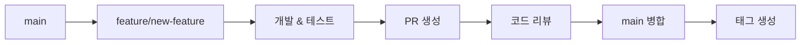

# 🌿 브랜치 전략

SnapFig 프로젝트의 Git 워크플로우와 브랜치 관리 전략을 설명합니다.

## 🎯 브랜치 전략 개요

SnapFig은 **GitHub Flow**를 기반으로 한 단순하고 효율적인 브랜치 전략을 사용하여 안정적인 개발과 배포를 보장합니다.

---

## 🌳 브랜치 구조

### 메인 브랜치

#### `main` 브랜치
- **목적**: 프로덕션 배포 및 릴리즈 브랜치
- **특징**: 
  - 항상 배포 가능한 상태
  - 모든 기능 브랜치의 최종 병합 대상
  - 직접 커밋 금지 (PR을 통해서만 병합)
  - 모든 테스트 통과 필수
  - 태그를 통한 버전 관리
- **보호 규칙**:
  - 직접 푸시 금지
  - PR 리뷰 필수 (최소 2명)
  - 상태 확인 통과 필수

### 지원 브랜치

#### `feature/*` 브랜치
- **목적**: 새로운 기능 개발
- **네이밍**: `feature/기능명` 또는 `feature/이슈번호-기능명`
- **생성 기준**: `main` 브랜치에서 분기
- **병합 대상**: `main` 브랜치
- **예시**:
  ```bash
  feature/pdf-viewer
  feature/123-ai-integration
  feature/figure-highlighting
  ```

#### `bugfix/*` 브랜치
- **목적**: 버그 수정
- **네이밍**: `bugfix/버그명` 또는 `bugfix/이슈번호-버그명`
- **생성 기준**: `main` 브랜치에서 분기
- **병합 대상**: `main` 브랜치
- **예시**:
  ```bash
  bugfix/pdf-loading-error
  bugfix/456-memory-leak
  bugfix/ocr-timeout
  ```

#### `hotfix/*` 브랜치
- **목적**: 프로덕션 긴급 수정
- **네이밍**: `hotfix/버전-수정내용`
- **생성 기준**: `main` 브랜치에서 분기
- **병합 대상**: `main` 브랜치
- **예시**:
  ```bash
  hotfix/1.0.1-critical-crash
  hotfix/1.0.2-security-fix
  ```

---

## 🔄 워크플로우

### 1. 기능 개발 워크플로우



#### 단계별 명령어

```bash
# 1. main 브랜치에서 최신 코드 가져오기
git checkout main
git pull origin main

# 2. 새 기능 브랜치 생성
git checkout -b feature/amazing-feature

# 3. 개발 작업 수행
# ... 코딩, 테스트 작성 ...

# 4. 변경사항 커밋
git add .
git commit -m "feat: Add amazing feature"

# 5. 원격 저장소에 푸시
git push origin feature/amazing-feature

# 6. GitHub에서 PR 생성
# main <- feature/amazing-feature

# 7. 리뷰 완료 후 병합
# 8. 로컬 브랜치 정리
git checkout main
git pull origin main
git branch -d feature/amazing-feature

# 9. 릴리즈 시 태그 생성
git tag -a v1.1.0 -m "Release version 1.1.0"
git push origin v1.1.0
```

### 2. 버그 수정 워크플로우

```bash
# 1. main 브랜치에서 분기
git checkout main
git pull origin main
git checkout -b bugfix/fix-critical-bug

# 2. 버그 수정 및 테스트
# ... 수정 작업 ...

# 3. 커밋 및 푸시
git add .
git commit -m "fix: Resolve critical bug in PDF loading"
git push origin bugfix/fix-critical-bug

# 4. PR 생성 및 리뷰
# main <- bugfix/fix-critical-bug

# 5. 병합 후 패치 버전 태그 생성 (필요시)
git checkout main
git pull origin main
git tag -a v1.0.1 -m "Patch release 1.0.1"
git push origin v1.0.1
```

### 3. 핫픽스 워크플로우

```bash
# 1. main 브랜치에서 분기
git checkout main
git pull origin main
git checkout -b hotfix/1.0.1-critical-fix

# 2. 긴급 수정
# ... 수정 작업 ...

# 3. 커밋 및 푸시
git add .
git commit -m "hotfix: Fix critical security vulnerability"
git push origin hotfix/1.0.1-critical-fix

# 4. main에 PR 생성 및 병합
# main <- hotfix/1.0.1-critical-fix

# 5. 핫픽스 태그 생성
git checkout main
git pull origin main
git tag -a v1.0.1 -m "Hotfix release 1.0.1"
git push origin v1.0.1
```

### 4. 릴리즈 워크플로우

main 브랜치를 릴리즈 브랜치로 사용하므로, 별도의 릴리즈 브랜치 없이 태그를 통해 버전을 관리합니다.

```bash
# 1. main 브랜치에서 릴리즈 준비
git checkout main
git pull origin main

# 2. 릴리즈 준비 작업 (버전 업데이트, 문서 정리 등)
# pubspec.yaml의 version 업데이트
# CHANGELOG.md 업데이트
# ... 기타 릴리즈 준비 작업 ...

# 3. 릴리즈 준비 커밋
git add .
git commit -m "chore: Prepare release 1.1.0"
git push origin main

# 4. 릴리즈 태그 생성
git tag -a v1.1.0 -m "Release version 1.1.0"
git push origin v1.1.0

# 5. GitHub에서 릴리즈 노트 작성 (선택사항)
```

---

## 📝 커밋 메시지 규칙

### 커밋 메시지 형식

```
<타입>: <제목>

<본문>

<푸터>
```

### 타입 (Type)

| 타입 | 설명 | 예시 |
|------|------|------|
| `feat` | 새로운 기능 추가 | `feat: Add zoom functionality` |
| `fix` | 버그 수정 | `fix: Resolve text recognition timeout` |
| `docs` | 문서 수정 | `docs: Update installation guide` |
| `style` | 코드 포맷팅, 세미콜론 누락 등 | `style: Fix code formatting` |
| `refactor` | 코드 리팩토링 | `refactor: Simplify provider logic` |
| `test` | 테스트 추가 또는 수정 | `test: Add unit tests` |
| `chore` | 빌드 프로세스, 보조 도구 변경 | `chore: Update dependencies` |
| `perf` | 성능 개선 | `perf: Optimize page loading` |
| `ci` | CI/CD 설정 변경 | `ci: Add automated testing workflow` |
| `build` | 빌드 시스템 변경 | `build: Update Flutter version` |


### 커밋 메시지 예시

#### 좋은 예시
```bash
feat: Add figure highlighting functionality

- Implement OCR-based figure detection
- Add visual highlighting for selected figures
- Integrate with AI service for figure analysis

Closes #123
```

```bash
fix: Resolve API timeout issue

The OpenAI API calls were timing out due to insufficient
timeout configuration. Increased timeout to 30 seconds
and added retry logic.

Fixes #456
```

#### 나쁜 예시
```bash
# 너무 간단함
fix: bug fix

# 타입 누락
Add new feature

# 의미 불명확
update code
```

---

## 🔍 PR (Pull Request) 가이드

### PR 생성 전 체크리스트

- [ ] 최신 main 브랜치와 동기화
- [ ] 모든 테스트 통과
- [ ] 코드 스타일 가이드 준수
- [ ] 관련 문서 업데이트
- [ ] 커밋 메시지 규칙 준수

### PR 제목 규칙

PR 제목은 커밋 메시지와 동일한 형식을 따릅니다:

```
<타입>: <제목>
```

**예시:**
- `feat: Add figure highlighting functionality`
- `fix: Resolve API timeout issue`
- `docs: Update installation guide`

### PR 설명 템플릿

```markdown
## 📝 변경사항 설명
이 PR에서 변경된 내용에 대한 명확한 설명

## 🔗 관련 이슈
- Closes #123
- Related to #456

## 🧪 테스트
- [ ] 단위 테스트 추가/수정
- [ ] 위젯 테스트 추가/수정
- [ ] 통합 테스트 추가/수정
- [ ] 수동 테스트 완료

## 📸 스크린샷 (UI 변경사항이 있는 경우)
변경 전후 스크린샷

## 📋 체크리스트
- [ ] 코드 스타일 가이드 준수
- [ ] 테스트 추가/수정
- [ ] 문서 업데이트
- [ ] 브레이킹 체인지 없음 (있다면 설명)

## 🔄 리뷰어
@reviewer1 @reviewer2
```

---


## 🔧 유용한 Git 명령어

### 브랜치 관리

```bash
# 모든 브랜치 확인
git branch -a

# 원격 브랜치 확인
git branch -r

# 브랜치 삭제
git branch -d feature/old-feature

# 원격 브랜치 삭제
git push origin --delete feature/old-feature

# 브랜치 이름 변경
git branch -m old-name new-name
```

### 동기화

```bash
# 원격 저장소 최신 정보 가져오기
git fetch origin

# main 브랜치와 동기화
git checkout main
git pull origin main

# 현재 브랜치를 main과 동기화
git rebase main
```

### 히스토리 관리

```bash
# 커밋 히스토리 확인
git log --oneline --graph

# 특정 파일의 변경 히스토리
git log --follow -- filename

# 브랜치 간 차이 확인
git diff main..feature/new-feature
```

---

## 📋 자주 묻는 질문

### Q: feature 브랜치에서 main의 최신 변경사항을 가져오려면?
```bash
git checkout feature/my-feature
git rebase main
```

### Q: 실수로 잘못된 브랜치에 커밋했다면?
```bash
# 커밋을 다른 브랜치로 이동
git checkout correct-branch
git cherry-pick <commit-hash>

# 원래 브랜치에서 커밋 제거
git checkout wrong-branch
git reset --hard HEAD~1
```

### Q: PR 병합 후 브랜치 정리는?
```bash
# 로컬 브랜치 삭제
git branch -d feature/merged-feature

# 원격 브랜치는 GitHub에서 자동 삭제 설정 권장
```

### Q: 충돌 해결 방법은?
```bash
# 리베이스 중 충돌 발생 시
git status  # 충돌 파일 확인
# 파일 수정 후
git add .
git rebase --continue
```

---

## 🎯 모범 사례

### 브랜치 네이밍
- **명확하고 설명적인 이름** 사용
- **이슈 번호 포함** (있는 경우)
- **소문자와 하이픈** 사용

### 커밋 관리
- **작은 단위로 자주 커밋**
- **의미 있는 커밋 메시지** 작성
- **관련 없는 변경사항은 분리**

### PR 관리
- **하나의 기능/수정사항당 하나의 PR**
- **명확한 설명과 테스트 결과** 포함
- **리뷰어 지정** 및 **피드백 적극 반영**

---